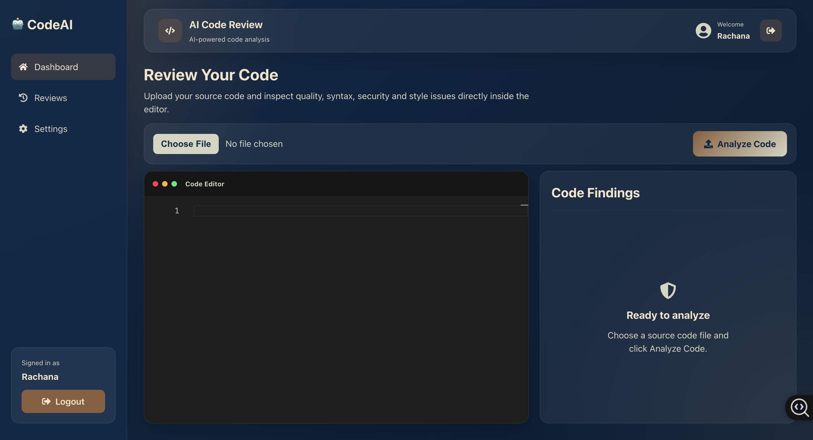
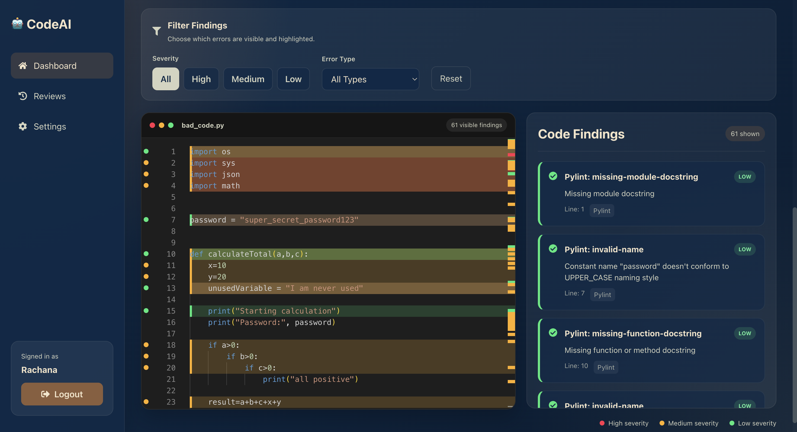
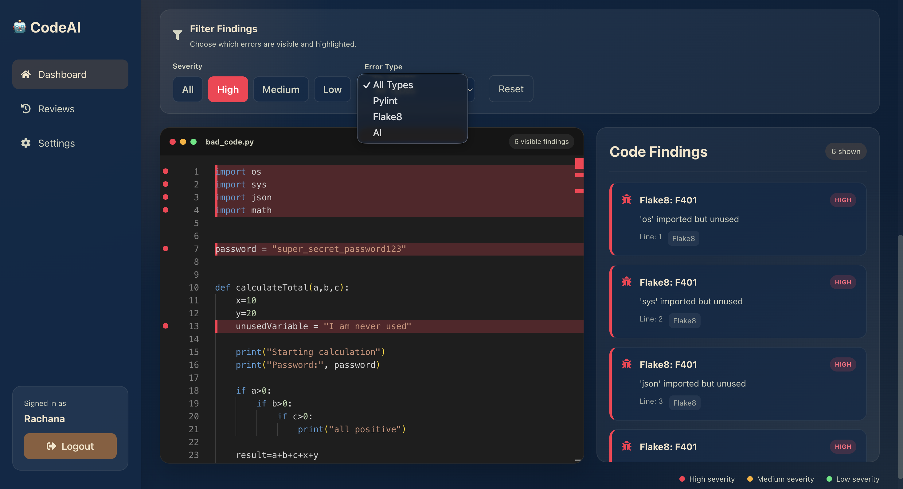
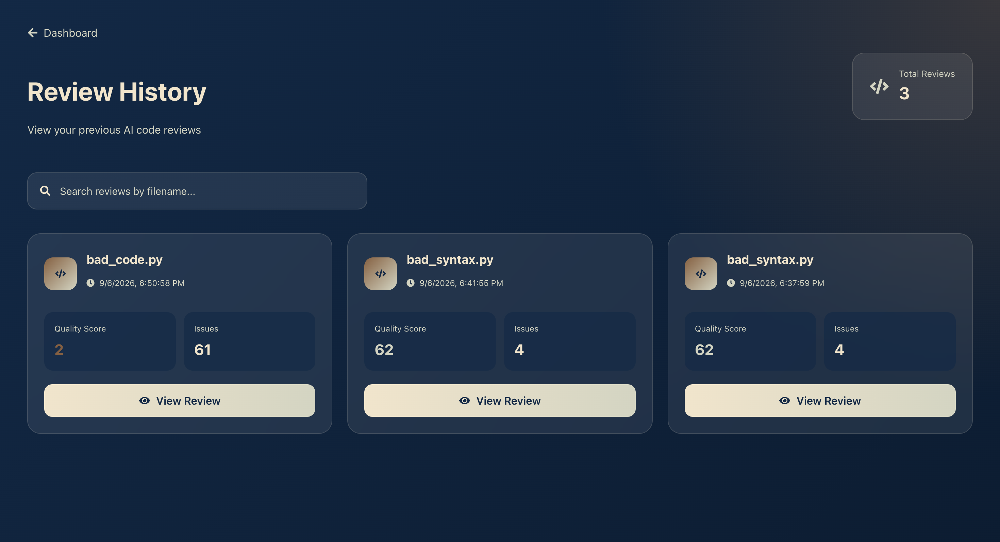
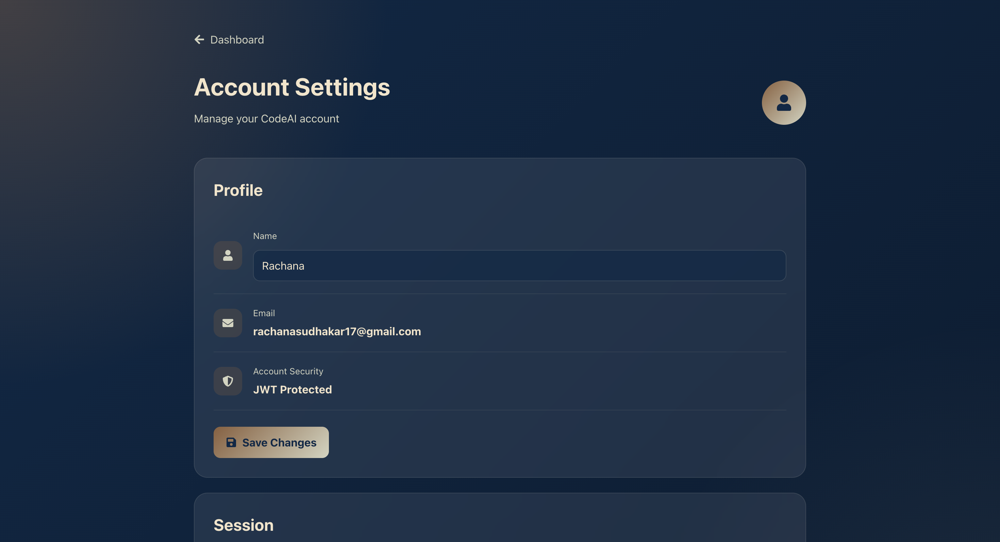
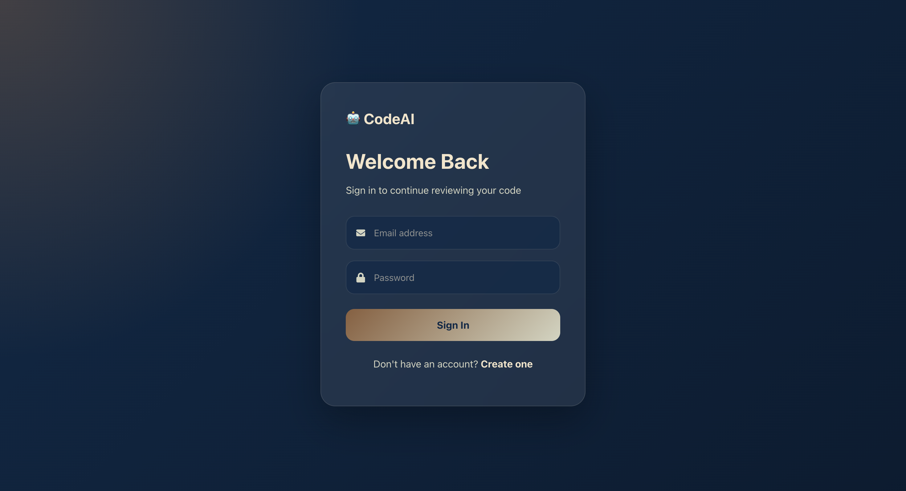
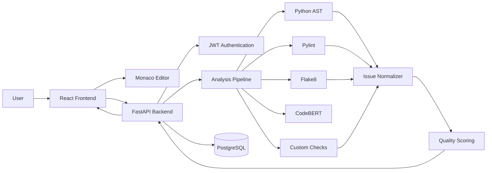
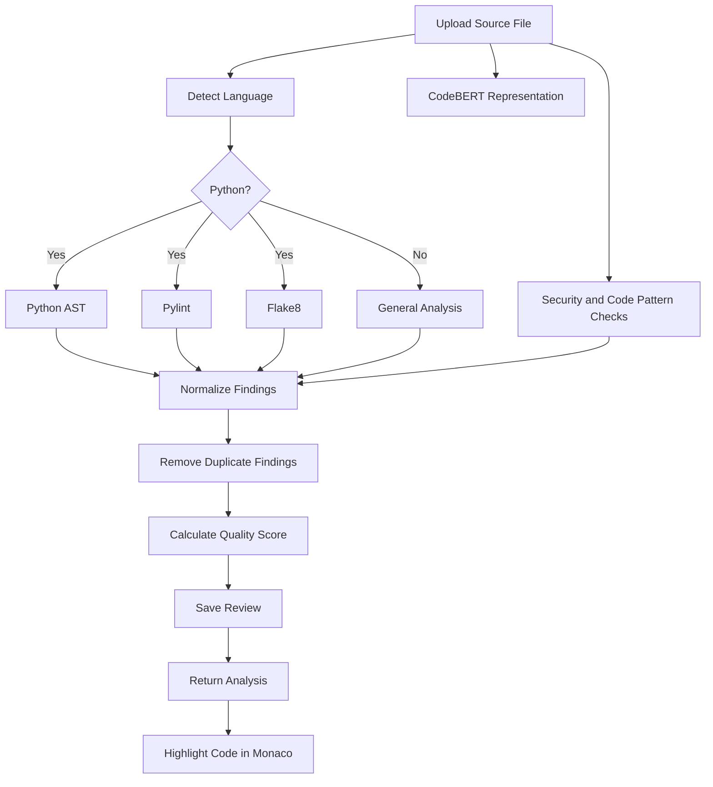

# 🤖 AI Code Review Assistant

An AI-powered full-stack code analysis platform that helps developers identify syntax errors, code-quality problems, security concerns, and style issues directly inside an interactive code editor.

The application combines **CodeBERT**, static-analysis tools, authentication, persistent review history, and a modern React dashboard to provide an IDE-style code review experience.

---

## 🚀 Overview

AI Code Review Assistant allows users to upload source-code files and receive automated analysis with:

- Syntax error detection
- Code-quality analysis
- Security checks
- Style and linting issues
- Severity-based issue classification
- Interactive code highlighting
- Error filtering
- Quality scoring
- Review history
- User-specific saved reviews
- JWT authentication
- Account management

The goal of the project is to combine **AI-assisted code understanding** with traditional static-analysis tools inside a modern full-stack application.

---

## 🖥️ Application Preview

### Dashboard

The main dashboard provides file upload, an interactive Monaco code editor, and a code-findings panel.



---

### Code Analysis

Detected issues are displayed alongside the source code.

High, medium, and low severity findings are highlighted using different colors.

- 🔴 High severity
- 🟠 Medium severity
- 🟢 Low severity



---

### Issue Filtering

Users can filter findings by severity or analysis source.

For example:

- Show only `HIGH` severity issues
- Show only `Pylint` findings
- Show only `Flake8` findings
- Show only `Python AST` syntax errors
- Combine severity and source filters

The Monaco editor updates its highlighted lines automatically based on the selected filters.



---

### Review History

Every completed review is stored in PostgreSQL and associated with the authenticated user.

Users can:

- View previous reviews
- See the quality score
- Inspect detected issues
- View previously reviewed code
- Delete saved reviews



---

### Account Settings

Users can manage their profile from the Settings page.



---

### Authentication

The application includes user registration and login using JWT-based authentication.



---

# ✨ Features

## 🔍 Multi-Stage Code Analysis

Python files are analyzed using multiple techniques.

### Python AST

Python's Abstract Syntax Tree parser detects syntax errors before further analysis.

Example:

```python
def calculate_total(a, b)
    return a + b
```

The application identifies the syntax error, line number, and severity.

---

### Pylint

Pylint detects maintainability and code-quality problems such as:

- Undefined variables
- Unused imports
- Invalid code patterns
- Refactoring opportunities
- Naming issues
- General code-quality warnings

---

### Flake8

Flake8 provides additional style and syntax-related validation.

It helps detect:

- PEP8 violations
- Formatting problems
- Import issues
- Undefined variables
- Syntax-related problems

---

### CodeBERT

The project integrates Microsoft's **CodeBERT** model using Hugging Face Transformers.

CodeBERT is currently used to generate a learned representation of the uploaded code.

```text
Source Code
     │
     ▼
Tokenizer
     │
     ▼
CodeBERT
     │
     ▼
Code Representation
```

The current version does **not** treat the base CodeBERT model as a trained code-quality classifier.

A future version will use the model representation for more advanced AI-driven recommendations.

---

## 🛡️ Custom Code Checks

The application also contains deterministic checks for potentially problematic code patterns.

Examples include:

```python
password = "mypassword"
```

```python
eval(user_input)
```

```python
except:
    pass
```

```python
print("debug")
```

The analyzer can identify issues such as:

- Hardcoded credentials
- Possible secret exposure
- Unsafe `eval()` usage
- Broad exception handling
- Debug statements
- Long lines
- TODO/FIXME comments
- Large source files

---

# 🎨 Interactive Code Review

The frontend uses the **Monaco Editor**, the same editor technology that powers Visual Studio Code.

Detected issues are highlighted directly inside the code.

```text
HIGH severity
████████████  Red

MEDIUM severity
████████████  Orange

LOW severity
████████████  Green
```

Clicking a finding automatically moves the editor to the corresponding line.

Hovering over highlighted code displays information about the issue.

---

# 🎯 Issue Filtering

Users can inspect one category of findings at a time.

### Severity filters

```text
All | High | Medium | Low
```

### Error-source filters

```text
All Types
Python AST
Pylint
Flake8
AI
```

Filters can also be combined.

For example:

```text
Severity: HIGH
Source: Pylint
```

Only matching findings are then:

- displayed in the findings panel
- highlighted inside Monaco
- shown in the editor overview ruler

---

# 📊 Code Quality Score

Every analyzed file receives a quality score between:

```text
0 ───────────────────────────── 100
Poor                              Excellent
```

The score is calculated from the severity of detected issues.

Current penalty model:

| Severity | Base Penalty |
|---|---:|
| 🔴 HIGH | 12 |
| 🟠 MEDIUM | 5 |
| 🟢 LOW | 2 |

Severity caps prevent one category of repeated lint findings from completely dominating the score.

---

# 🔐 Authentication

The application uses JWT authentication.

Users can:

- Register
- Login
- Access protected routes
- Update their profile
- Logout
- Access only their own reviews

Passwords are hashed using `bcrypt` before being stored.

Authentication flow:

```text
Register / Login
       │
       ▼
FastAPI
       │
       ▼
Password Verification
       │
       ▼
JWT Token
       │
       ▼
React Client
       │
       ▼
Protected API Requests
```

---

# 🗄️ Database

The application uses **PostgreSQL hosted on Render**.

Current main entities:

```text
User
 ├── id
 ├── name
 ├── email
 ├── hashed_password
 └── created_at

        │
        │ One-to-Many
        ▼

Review
 ├── id
 ├── filename
 ├── code
 ├── quality_score
 ├── analysis
 ├── created_at
 └── user_id
```

Each review belongs to the user who created it.

API queries use the authenticated user's ID so users cannot access another user's review history.

---

# 🏗️ System Architecture



---

# 🔄 Code Analysis Pipeline



---

# 🛠️ Tech Stack

## Frontend

- React
- JavaScript
- Monaco Editor
- React Router
- Axios
- React Icons
- Recharts
- Framer Motion
- CSS

## Backend

- Python
- FastAPI
- SQLAlchemy
- JWT
- bcrypt
- Python AST
- Pylint
- Flake8

## AI / Machine Learning

- PyTorch
- Hugging Face Transformers
- Microsoft CodeBERT

## Database

- PostgreSQL
- Render PostgreSQL

---

# 📁 Project Structure

```text
AI-Code-Review-Assistant
│
├── backend
│   ├── main.py
│   │
│   └── app
│       ├── analyzer
│       │   ├── code_analyzer.py
│       │   ├── language_detector.py
│       │   ├── normalizer.py
│       │   ├── quality_analyzer.py
│       │   └── scoring.py
│       │
│       ├── ai_model
│       │   └── codebert_analyzer.py
│       │
│       ├── auth
│       │   ├── auth.py
│       │   └── routes.py
│       │
│       ├── database.py
│       ├── models.py
│       ├── schemas.py
│       └── uploads
│
├── frontend
│   ├── public
│   │
│   └── src
│       ├── components
│       │   ├── Analytics
│       │   │   ├── IssueChart.js
│       │   │   └── QualityScore.js
│       │   │
│       │   ├── Auth
│       │   │   ├── Login.js
│       │   │   ├── Register.js
│       │   │   └── ProtectedRoute.js
│       │   │
│       │   ├── Navbar
│       │   │   └── Navbar.js
│       │   │
│       │   ├── Reviews
│       │   │   └── Reviews.js
│       │   │
│       │   ├── Settings
│       │   │   └── Settings.js
│       │   │
│       │   └── Dashboard.js
│       │
│       ├── services
│       │   └── api.js
│       │
│       └── App.js
│
├── screenshots
│
├── .gitignore
└── README.md
```

---

# ⚙️ Local Setup

## 1. Clone the repository

```bash
git clone https://github.com/YOUR_USERNAME/AI-Code-Review-Assistant.git

cd AI-Code-Review-Assistant
```

---

## 2. Backend Setup

```bash
cd backend

python3 -m venv venv

source venv/bin/activate
```

For Windows:

```bash
venv\Scripts\activate
```

Install dependencies:

```bash
pip install -r requirements.txt
```

---

## 3. Environment Variables

Create:

```text
backend/.env
```

Add:

```env
DATABASE_URL=your_postgresql_database_url
SECRET_KEY=your_secret_key
```

Never commit this file.

Generate a secure secret key using:

```bash
python -c "import secrets; print(secrets.token_hex(32))"
```

---

## 4. Start Backend

From:

```text
backend/
```

run:

```bash
uvicorn main:app --reload
```

The API will run at:

```text
http://127.0.0.1:8000
```

FastAPI documentation:

```text
http://127.0.0.1:8000/docs
```

---

## 5. Frontend Setup

Open another terminal:

```bash
cd frontend

npm install

npm start
```

The React application will run at:

```text
http://localhost:3000
```

---

# 🔌 API Endpoints

## Authentication

```text
POST /auth/register
POST /auth/login
PUT  /auth/profile
GET  /me
```

## Analysis

```text
POST /upload
```

## Reviews

```text
GET    /reviews
DELETE /reviews/{review_id}
```

Protected endpoints require:

```http
Authorization: Bearer <JWT_TOKEN>
```

---

# 🧪 Example Analysis

Given:

```python
password = "admin123"

def calculate(a, b):
    print("debug")
    return eval(a)
```

The application may identify findings such as:

```text
🔴 Possible Credential Exposure
Avoid storing passwords directly in source code.

🔴 Unsafe eval() Usage
Avoid eval() because it can execute arbitrary code.

🟢 Debug Statements
Remove print statements before production deployment.
```

These findings are displayed both in the findings panel and directly on the corresponding Monaco editor lines.

---

# 🌐 Supported Languages

Current upload support:

| Language | Extension | Static Analysis |
|---|---|---|
| Python | `.py` | AST + Pylint + Flake8 + custom checks |
| JavaScript | `.js` | Custom analysis |
| JSX | `.jsx` | Custom analysis |
| Java | `.java` | Custom analysis |

Python currently has the most complete static-analysis pipeline.

Additional language-specific analyzers are planned.

---

# 🗺️ Roadmap

Current development roadmap:

- [x] FastAPI backend
- [x] React frontend
- [x] Monaco code editor
- [x] Python AST analysis
- [x] Pylint integration
- [x] Flake8 integration
- [x] CodeBERT integration
- [x] Code-quality scoring
- [x] Severity classification
- [x] Code-line highlighting
- [x] Severity filtering
- [x] Analysis-source filtering
- [x] JWT authentication
- [x] PostgreSQL integration
- [x] User-specific reviews
- [x] Review deletion
- [x] Account settings
- [ ] Secure temporary upload processing
- [ ] Automatic uploaded-file cleanup
- [ ] JavaScript-specific static analysis
- [ ] Java-specific static analysis
- [ ] AI recommendation engine
- [ ] CodeBERT fine-tuning
- [ ] Alembic migrations
- [ ] Docker support
- [ ] Backend deployment
- [ ] Frontend deployment
- [ ] Automated testing
- [ ] CI/CD pipeline

---

# 🔮 Planned AI Recommendation Engine

The recommendation section has intentionally been removed from the current UI.

The future implementation will provide recommendations only after a dedicated recommendation pipeline has been implemented.

Planned features include:

```text
Detected Issue
      │
      ▼
Code Context
      │
      ▼
AI Recommendation Engine
      │
      ├── Explanation
      ├── Suggested Fix
      ├── Refactored Code
      └── Security Recommendation
```

This prevents the application from presenting deterministic lint findings as if they were generated by a trained AI recommendation system.

---

# 🔒 Security Considerations

The project currently includes:

- bcrypt password hashing
- JWT authentication
- Protected API endpoints
- User-specific database queries
- Environment-variable based secrets
- File-extension validation
- Filename sanitization

Additional security improvements are planned, including temporary upload files and automatic cleanup after analysis.

---

# 💡 Why I Built This

Traditional static analyzers are powerful, but their output is often separated from the developer's actual workflow.

This project explores how static analysis, machine-learning models, and modern web interfaces can be combined into a single code-review experience.

It also serves as an end-to-end software engineering project involving:

- Full-stack application development
- REST API design
- Authentication
- Relational database design
- Machine learning integration
- Static code analysis
- Security
- Interactive frontend development
- Cloud-hosted infrastructure

---

# 👩‍💻 Author

**Rachana Sudhakar**

Software Engineer | Full-Stack Development | AI/ML

---

## ⭐ Support

If you found this project useful or interesting, consider giving the repository a ⭐.